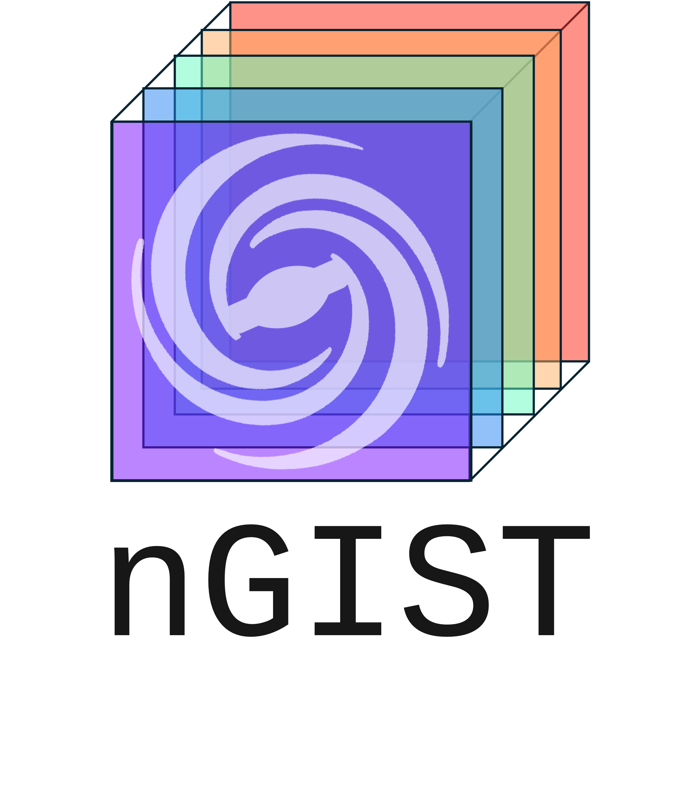

# home

## Welcome to nGIST's documentation!

Welcome the the documentation for the [nGIST pipeline!](https://github.com/geckos-survey/ngist)
nGIST is the extension of the [gist pipeline](https://abittner.gitlab.io/thegistpipeline/), originally written by [Adrian Bittner](https://ui.adsabs.harvard.edu/abs/2019A%26A...628A.117B/abstract). The current lead developers are Amelia Fraser-McKelvie and Jesse van de Sande

nGIST is a modular, python-based pipeline for the analysis of integral field spectroscopic data. The pipeline has been developed initially for use with the ESO-VLT/MUSE [GECKOS](https://geckos-survey.org/) and [MAUVE](https://mauve.icrar.org/) large programmes, but can be adapted to any MUSE data (and indeed any IFS galaxy data).

nGIST reads a galaxy spectral cube, spatially masks it, Voronoi bins (if required), and then performs scientific analysis on it. Current modules perform stellar kinematic extraction, emission lines measures, stellar populations, and line strength measures. An additional, User-defined module, may be adapted to do whatever you like! The outputs are easy-to-read 2D maps files, which may be fed straight into your favourite plotting script, or used with the included mapviewer. 
