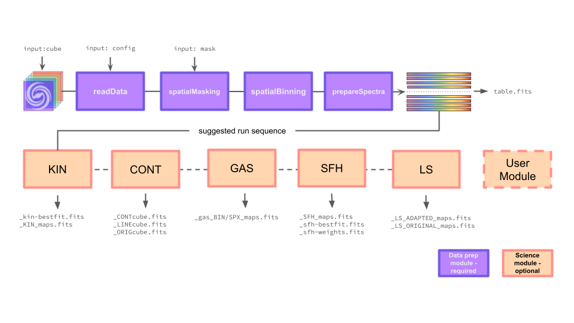

# Overview
- nGIST is a python-based framework that can be run from the command line in one simple step.

- nGIST is currently made up of ten modules, which may be switched on or off according to the user's wishes:

 
*Basic flow chart of the ten nGIST modules. The top four are preparatory modules, while the bottom six are the science modules. Only the preparatory modules must be run - all others can be switched on or off according to a user's wishes. What is shown here is the recommended running sequence. In theory, the science mmodules can be run in any order.*

- Configuration is controlled by a config .yaml file. This file houses the variables required.

