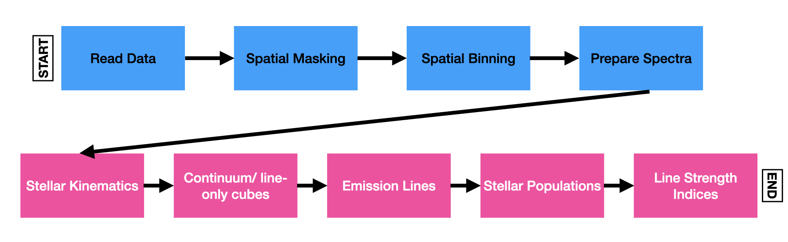

# Overview

- nGIST is currently made up of nine modules, which may be switched on or off according to the user's wishes:

 
*Basic flow chart of the nine nGIST modules. The top four are preparatory modules, while the bottom five are the science modules. Only the readData module must be run - all others can be switched on or off according to a user's wishes.*

- Configuration is controlled by a config .yaml file. This file houses the variables required.

- nGIST is a python-based framework that can be run from the command line in one simple step.

